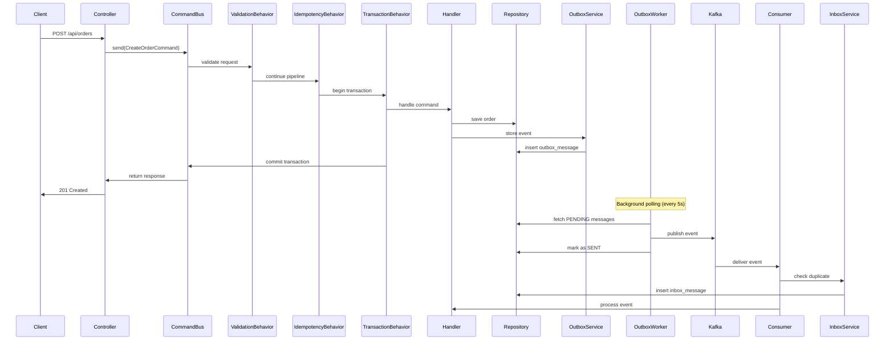

# Enterprise CQRS Architecture

## Overview

This document describes the enterprise-grade CQRS (Command Query Responsibility Segregation) architecture implemented in the SpringCRM platform. The architecture follows Clean Architecture principles with strict separation of concerns across domain, application, infrastructure, and presentation layers.

## Architecture Principles

### Clean Architecture Layers

```
┌─────────────────────────────────────────────────────────────┐
│                    Presentation Layer                       │
│              (REST Controllers, DTOs)                      │
├─────────────────────────────────────────────────────────────┤
│                    Application Layer                        │
│         (Commands, Queries, Handlers, Behaviors)           │
├─────────────────────────────────────────────────────────────┤
│                     Domain Layer                           │
│      (Entities, Value Objects, Domain Services)            │
├─────────────────────────────────────────────────────────────┤
│                  Infrastructure Layer                      │
│    (JPA Entities, Repositories, Kafka, Redis, Outbox)     │
└─────────────────────────────────────────────────────────────┘
```

### Key Design Decisions

1. **Persistence-Ignorant Domain**: Domain entities contain no JPA annotations
2. **CQRS Separation**: Commands (writes) and Queries (reads) are handled separately
3. **Pipeline Behaviors**: Cross-cutting concerns implemented as behaviors
4. **Outbox Pattern**: Reliable event publishing with transactional guarantees
5. **Inbox Pattern**: Idempotent event consumption with deduplication
6. **Redis + DB Fallback**: Dual-layer idempotency and caching

## CQRS Framework

### Core Interfaces

```java
// Command (write operation)
public interface Command<TResponse> {}

// Query (read operation)  
public interface Query<TResponse> {}

// Command handler
public interface CommandHandler<TCommand, TResponse> {
    TResponse handle(TCommand command);
    Class<TCommand> getCommandType();
}

// Query handler
public interface QueryHandler<TQuery, TResponse> {
    TResponse handle(TQuery query);
    Class<TQuery> getQueryType();
}
```

### Pipeline Behaviors

Behaviors execute in the following order:

1. **ValidationBehavior** (Order: 100) - Jakarta Bean Validation
2. **IdempotencyBehavior** (Order: 200) - Duplicate request prevention
3. **TransactionBehavior** (Order: 300) - Database transaction management
4. **LoggingBehavior** (Order: 1000) - Request/response logging with timing

### Command Bus Flow

```
Request → ValidationBehavior → IdempotencyBehavior → TransactionBehavior → Handler → LoggingBehavior → Response
```

## Event-Driven Architecture

### Outbox Pattern

The outbox pattern ensures reliable event publishing by storing events in the same database transaction as the business operation:

```sql
CREATE TABLE outbox_messages (
    id CHAR(36) PRIMARY KEY,
    aggregate_type VARCHAR(100) NOT NULL,
    aggregate_id VARCHAR(100) NOT NULL,
    event_type VARCHAR(150) NOT NULL,
    event_data JSON NOT NULL,
    status VARCHAR(20) NOT NULL DEFAULT 'PENDING',
    retry_count INT NOT NULL DEFAULT 0,
    created_at DATETIME(6) NOT NULL,
    processed_at DATETIME(6) NULL
);
```

### Kafka Integration

- **Topic Naming**: `{service}.{aggregate}.{action}` (e.g., `crm.order.created`)
- **DLQ Pattern**: Failed messages go to `{topic}.dlq`
- **Idempotent Producer**: Configured with `enable.idempotence=true`
- **Partitioning**: Uses aggregate ID as partition key

### Inbox Pattern

Prevents duplicate event processing using unique message IDs:

```sql
CREATE TABLE inbox_messages (
    id CHAR(36) PRIMARY KEY,
    message_id VARCHAR(255) NOT NULL UNIQUE,
    event_type VARCHAR(150) NOT NULL,
    source_service VARCHAR(100) NOT NULL,
    processed_at DATETIME(6) NOT NULL
);
```

## Data Flow Sequence



## Idempotency Strategy

### Dual-Layer Approach

1. **Redis Layer** (Primary):
   - Fast in-memory locking with `SETNX`
   - Response caching for completed requests
   - TTL-based expiration

2. **Database Layer** (Fallback):
   - Unique constraint on idempotency key
   - Persistent storage for Redis outages
   - Automatic cleanup of expired records

### Implementation

```java
@Idempotent(ttlSeconds = 3600)
public class CreateOrderCommand implements Command<CreateOrderResponse> {
    // Command fields
}
```

## Error Handling

### Structured Error Response

```json
{
  "code": "ORDER_200",
  "message": "Order not found",
  "traceId": "abc123def456",
  "path": "/api/orders/123",
  "timestamp": "2026-03-21T10:00:00Z",
  "details": [
    {
      "field": "orderId",
      "message": "Order ID is required"
    }
  ]
}
```

### Error Categories

- **Validation Errors** (400): Field validation failures
- **Business Errors** (400/409): Domain rule violations
- **Not Found Errors** (404): Resource not found
- **System Errors** (500): Infrastructure failures

## Observability

### Structured Logging

All logs include:
- `traceId`: Request correlation ID
- `userId`: Authenticated user ID
- `requestPath`: API endpoint path
- `duration`: Request processing time

### Metrics

Key metrics exposed via Micrometer:
- Request duration by endpoint
- Error rate by error code
- Outbox processing lag
- Idempotency hit rate

### Tracing

OpenTelemetry spans for:
- HTTP requests
- Command/query processing
- Database operations
- Kafka publishing/consuming

## Deployment Configuration

### Required Environment Variables

```yaml
# Database
SPRING_DATASOURCE_URL: jdbc:mysql://localhost:3306/crm_db
SPRING_DATASOURCE_USERNAME: crm_user
SPRING_DATASOURCE_PASSWORD: ${DB_PASSWORD}

# Redis
REDIS_HOST: localhost
REDIS_PORT: 6379

# Kafka
KAFKA_BOOTSTRAP_SERVERS: localhost:9092

# Observability
OTEL_EXPORTER_OTLP_ENDPOINT: http://localhost:4317
```

### Health Checks

- `/actuator/health` - Overall service health
- `/actuator/prometheus` - Metrics endpoint
- Database connectivity check
- Redis connectivity check
- Kafka connectivity check

## Operational Runbook

### Monitoring Alerts

1. **High Error Rate**: Error rate > 5% for 5 minutes
2. **High Latency**: 95th percentile > 1 second for 5 minutes
3. **Outbox Lag**: Pending messages > 100 for 10 minutes
4. **Database Connection Pool**: Usage > 90% for 2 minutes

### Troubleshooting

#### Outbox Messages Stuck

```sql
-- Check pending messages
SELECT COUNT(*) FROM outbox_messages WHERE status = 'PENDING';

-- Check failed messages
SELECT * FROM outbox_messages WHERE status = 'FAILED' ORDER BY created_at DESC LIMIT 10;

-- Retry failed messages (reset status)
UPDATE outbox_messages SET status = 'PENDING', retry_count = 0 WHERE status = 'FAILED';
```

#### Idempotency Issues

```sql
-- Check Redis connectivity
PING

-- Check database fallback
SELECT COUNT(*) FROM idempotency_records WHERE status = 'PROCESSING';

-- Clean up expired records
DELETE FROM idempotency_records WHERE expires_at < NOW();
```

#### Kafka Consumer Lag

```bash
# Check consumer group lag
kafka-consumer-groups.sh --bootstrap-server localhost:9092 --group crm-service --describe

# Check DLQ messages
kafka-console-consumer.sh --bootstrap-server localhost:9092 --topic crm.order.created.dlq --from-beginning
```

## Performance Characteristics

### Expected Throughput

- **Commands**: 1000 TPS per instance
- **Queries**: 5000 TPS per instance
- **Event Processing**: 2000 events/second

### Latency Targets

- **P50**: < 100ms
- **P95**: < 500ms
- **P99**: < 1000ms

### Scalability

- Horizontal scaling via multiple instances
- Database read replicas for queries
- Kafka partitioning for parallel processing
- Redis clustering for high availability

## Security Considerations

### Authentication & Authorization

- JWT-based authentication
- RBAC permissions checked in controllers
- User context propagated through MDC

### Data Protection

- Sensitive data excluded from logs
- Encryption at rest for database
- TLS for all network communication

### Audit Trail

- All commands logged with user context
- Outbox events provide change history
- Immutable event log in Kafka

## Migration Strategy

### Incremental Adoption

1. **Phase 1**: Implement CQRS framework in shared-lib
2. **Phase 2**: Migrate one service (crm-service) completely
3. **Phase 3**: Migrate remaining services endpoint by endpoint
4. **Phase 4**: Remove legacy service classes

### Rollback Plan

- Feature flags to switch between CQRS and legacy handlers
- Database schema supports both approaches during transition
- Gradual traffic shifting with monitoring

## Future Enhancements

### Planned Improvements

1. **Event Sourcing**: Store all state changes as events
2. **Saga Pattern**: Distributed transaction management
3. **CQRS Read Models**: Optimized query projections
4. **Event Replay**: Ability to rebuild state from events
5. **Multi-tenant Support**: Tenant isolation in commands/queries

### Technology Roadmap

- **Spring Boot 4.x**: Upgrade to latest version
- **Virtual Threads**: Improve concurrency performance
- **GraalVM**: Native image compilation for faster startup
- **Kubernetes**: Container orchestration and auto-scaling