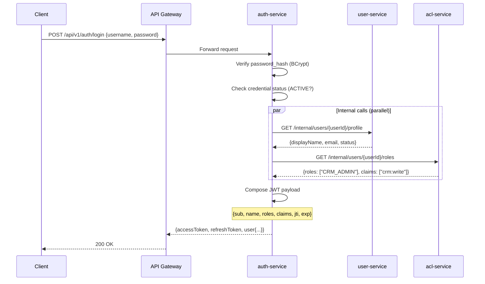
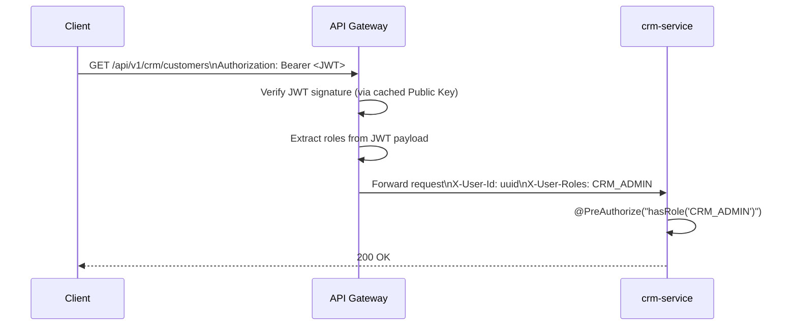
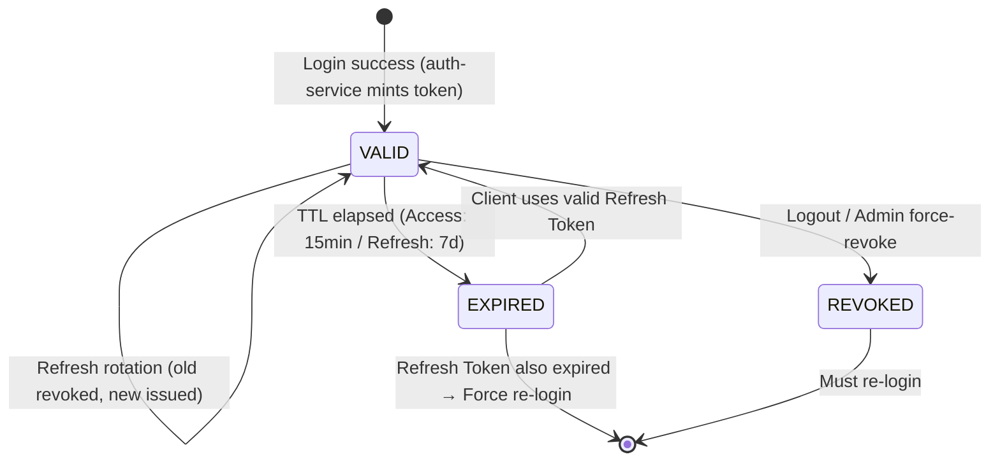

# IAM Service Boundaries — Enterprise Identity & Access Management Architecture

## 1. Overview

SpringCRM adopts a **3-pillar IAM architecture** modelled after Microsoft Azure AD / Entra ID.
Each pillar owns exactly one domain concern and exposes a stable service interface.
The JWT Access Token is the **single binding contract** that carries aggregated identity context across service boundaries.

```
         ┌─────────────────────────────────────────────────────┐
         │              Enterprise IAM Layer                   │
         │                                                     │
         │  ┌───────────────┐  ┌───────────────┐  ┌────────────────┐ │
         │  │  auth-service  │  │ user-service  │  │  acl-service   │ │
         │  │  (Ticket Master│  │ (The Phonebook│  │  (The Bouncer) │ │
         │  └───────┬───────┘  └───────┬───────┘  └───────┬────────┘ │
         │          │ AGGREGATES on    │ PROVIDES          │ PROVIDES  │
         │          │ login →          │ displayName       │ roles[]   │
         │          └─────────── JWT Access Token ─────────┘          │
         └─────────────────────────────────────────────────────────────┘
```

---

## 2. Service Responsibility Matrix

| Responsibility | auth-service | user-service | acl-service |
|---|---|---|---|
| Verify username + password | ✅ | ❌ | ❌ |
| Issue JWT Access Token | ✅ | ❌ | ❌ |
| Refresh / Revoke Token | ✅ | ❌ | ❌ |
| Store credential (password_hash) | ✅ | ❌ | ❌ |
| Store user profile (name, email, dept) | ❌ | ✅ | ❌ |
| Create / Deactivate user accounts | ❌ | ✅ | ❌ |
| List / Search users | ❌ | ✅ | ❌ |
| Define Roles and Permissions | ❌ | ❌ | ✅ |
| Assign Role to User | ❌ | ❌ | ✅ |
| Provide roles[] for JWT composition | ❌ | ❌ | ✅ |
| Provide displayName for JWT | ❌ | ✅ | ❌ |

> **Analogy (Microsoft):**
> - auth-service ≈ Azure AD Authentication (`login.microsoftonline.com`)
> - user-service ≈ Microsoft Graph API (`graph.microsoft.com/users`)
> - acl-service ≈ Azure RBAC (`management.azure.com/roleAssignments`)

---

## 3. Data Ownership (Database per Service)

Each service **exclusively owns** its database. No cross-service JOIN queries.

```
auth-service DB             user-service DB            acl-service DB
───────────────             ───────────────            ──────────────
auth_credentials            user_profiles              acl_roles
auth_sessions               user_settings              acl_claims
                                                       acl_permissions
                                                       acl_user_roles
                                                       acl_role_permissions
```

Cross-service data references use `user_id` (UUID) as a **logical soft key** — no database-level foreign key constraints between services.

---

## 4. JWT Composition Flow (Login Aggregation)

On login, `auth-service` acts as an **Aggregator** calling the other two services internally before minting the JWT:



**JWT Payload Example (Access Token):**
```json
{
  "sub": "user-uuid-123",
  "name": "Jack Admin",
  "email": "jack@springcrm.com",
  "roles": ["CRM_ADMIN"],
  "claims": ["crm:write", "crm:read"],
  "jti": "unique-token-id",
  "iat": 1700000000,
  "exp": 1700000900
}
```

---

## 5. Zero-Trust Token Forwarding (Downstream Services)

After login, downstream services (e.g. `crm-service`) **never call `auth-service`** to re-validate each request. Instead:



- Gateway caches the **RS256 public key** from `auth-service` (fetched once at startup / JWKS endpoint).
- All services downstream trust the **X-User-Id** and **X-User-Roles** headers injected by the gateway.
- No service makes a synchronous call to `auth-service` per business request.

---

## 6. Inter-Service Communication Topology

| From | To | Protocol | Purpose | On Failure |
|---|---|---|---|---|
| auth-service | user-service | HTTP (internal) | Fetch displayName during login JWT mint | Return JWT without name (non-critical) |
| auth-service | acl-service | HTTP (internal) | Fetch user roles during login JWT mint | Return 500 (critical — no token without roles) |
| acl-service | user-service | HTTP (internal) | Validate user exists before role assignment | Return 404 |
| API Gateway | auth-service | — | Fetch JWKS public key at startup | Retry/fail fast |
| crm-service | user-service | HTTP (optional) | Enrich owner display name in response | Degrade gracefully |

All internal endpoints are prefixed `/internal/` and are **NOT exposed** through the API Gateway.  
Internal communication uses private network (Docker network / VPC) with no public access.

---

## 7. Token Lifecycle Diagram



---

## 8. Role Assignment Flow

Role assignment is exclusively managed by `acl-service`. When a user's roles change:

1. Admin calls `POST /api/v1/acl/users/{userId}/roles` (acl-service endpoint).
2. `acl-service` updates `acl_user_roles` table.
3. Change takes effect on the user's **next token refresh** (auth-service re-queries acl-service).
4. Optionally: `acl-service` publishes `user.roles.changed` event (Kafka) for audit + forced logout.

> **No real-time role push** in v1. Role changes are eventual (next refresh cycle).

---

## 9. Scalability Implications

| Service | Scale Driver | Scale Strategy |
|---|---|---|
| auth-service | Login burst (peak hours) | Horizontal scale 2-5 pods |
| user-service | Profile reads (onboarding, search) | Horizontal scale + read cache |
| acl-service | Role check queries (low frequency) | Horizontal scale + Redis cache for `getUserRoles` |
| API Gateway | All traffic | Horizontal scale + JWKS key cache |

ACL Service lookup at login is cached in Redis `user:{userId}:roles` with TTL tied to access token TTL (15 min) to avoid repeated DB calls during burst login.
