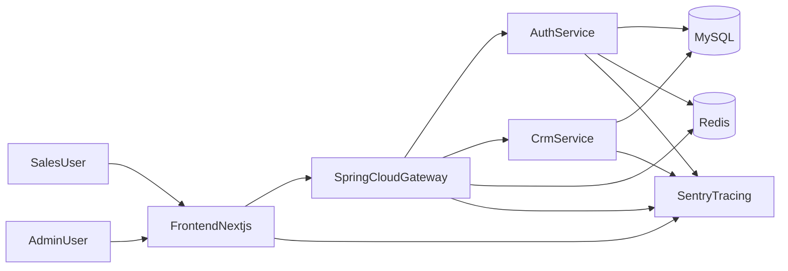
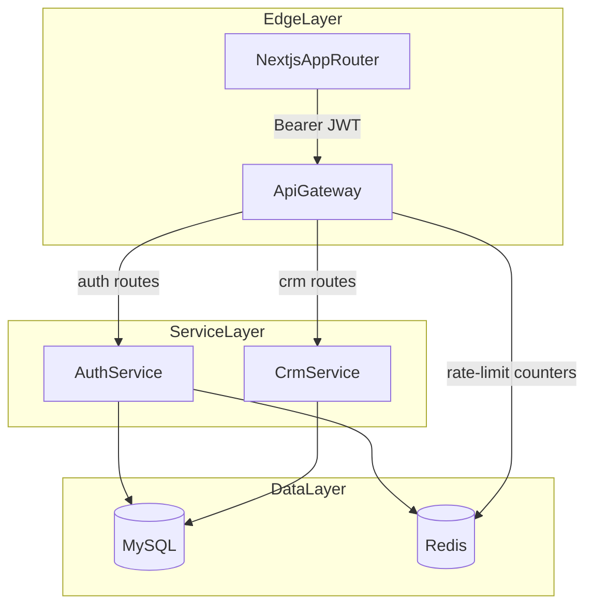
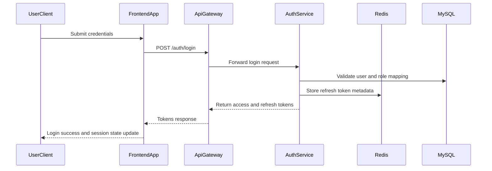
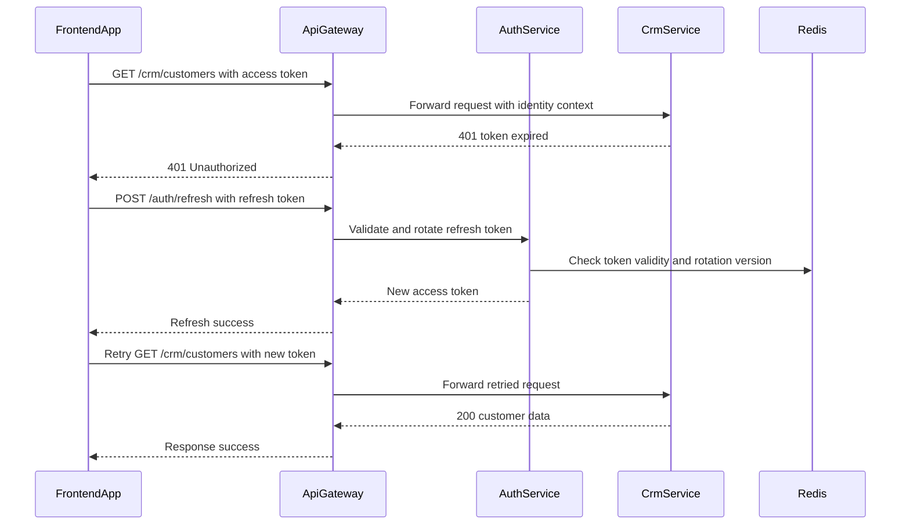
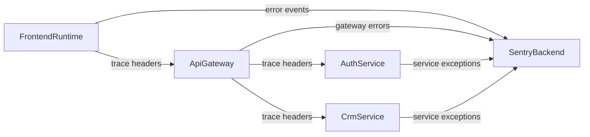

# Microservice Architecture Diagram

This document provides the visual architecture views used for development alignment.

## 1. System Context Diagram

## 2. Container-Level Request Flow

## 3. Authentication Sequence

## 4. Protected CRM Request with Refresh Flow

## 5. Observability and Trace Propagation

## 6. Diagram Usage Rules

- Use these diagrams as canonical references for onboarding and implementation sequencing.
- Update diagrams when changing service boundaries, token flow, or data topology.
- Keep IDs stable to reduce merge conflicts and maintain documentation consistency.
