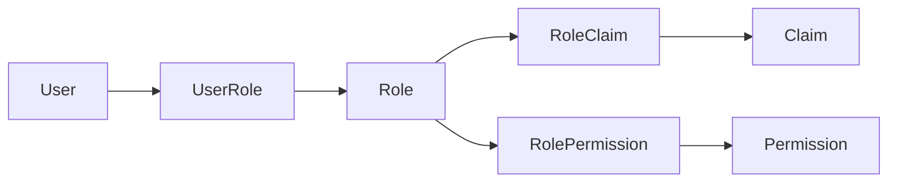

# RBAC Model

## 1. Objective

Provide a consistent authorization model for all platform operations using:

- Users
- Roles
- Claims
- Permissions
- Role and user mappings

## 2. Entity Definitions

- `User`
  - Identity subject that can authenticate and perform actions.
- `Role`
  - Bundle of claims and permissions representing job responsibility.
- `Claim`
  - Token-level identity attributes used in policy checks.
- `Permission`
  - Action grant on a resource (`resource:action`).
- `UserRole`
  - Many-to-many mapping between user and role.
- `RoleClaim`
  - Many-to-many mapping between role and claim.
- `RolePermission`
  - Many-to-many mapping between role and permission.

## 3. Relationship Diagram

## 4. Authorization Evaluation Flow

1. User authenticates and receives JWT.
2. JWT includes role and claim snapshot.
3. Gateway validates token integrity and forwards identity context.
4. Target service checks endpoint policy:
   - role check for broad access
   - permission check for fine-grained action.
5. Service returns `403` if policy is not satisfied.

## 5. Policy Expression Standard

- Permission syntax: `<resource>:<action>`.
- Examples:
  - `customer:read`
  - `customer:update`
  - `lead:create`
  - `task:assign`

## 6. Seed Role Matrix (v1)

| Role | Core Permissions |
|---|---|
| `SUPER_ADMIN` | Full platform administration |
| `CRM_ADMIN` | CRM module administration and assignment control |
| `SALES_MANAGER` | Team pipeline visibility and opportunity/task management |
| `SALES_REP` | Own customer/lead/opportunity/task operations |
| `AUDITOR` | Read-only access to operational and audit views |

## 7. Least-Privilege Rules

- Default role assignments grant minimum required permissions only.
- New permissions are denied-by-default until mapped explicitly.
- High-risk operations (role assignment, user status changes) require admin-level role.

## 8. Token Claim Strategy

JWT payload includes:

- `user_id`
- `roles` (codes)
- `claims` (identity/business qualifiers)
- `jti`, `iat`, `exp`

Guidelines:

- Keep claims compact to avoid oversized tokens.
- Recompute role and permission effect on token refresh.
- Do not include sensitive PII in claims.

## 9. Governance and Change Process

- RBAC changes require:
  - policy review
  - migration script for permission seed updates
  - documentation update in this file and auth service design.
- Breaking permission renames require deprecation alias period where feasible.
