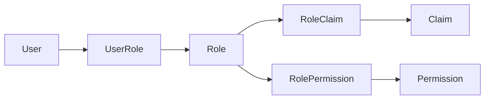
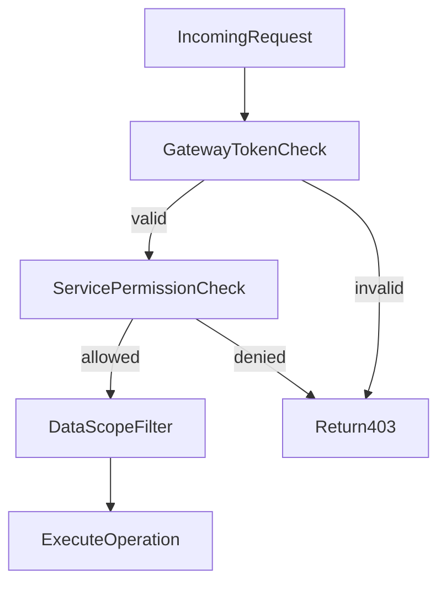

# RBAC Model

## 1. Objective

Provide a consistent authorization model for all platform operations using:

- Users
- Roles
- Claims
- Permissions
- Role and user mappings

## 2. Entity Definitions

- `User`
  - Identity subject that can authenticate and perform actions.
- `Role`
  - Bundle of claims and permissions representing job responsibility.
- `Claim`
  - Token-level identity attributes used in policy checks.
- `Permission`
  - Action grant on a resource (`resource:action`).
- `UserRole`
  - Many-to-many mapping between user and role.
- `RoleClaim`
  - Many-to-many mapping between role and claim.
- `RolePermission`
  - Many-to-many mapping between role and permission.

## 3. Relationship Diagram

## 4. Authorization Evaluation Flow

1. User authenticates and receives JWT.
2. JWT includes role and claim snapshot.
3. Gateway validates token integrity and forwards identity context.
4. Target service checks endpoint policy:
   - role check for broad access
   - permission check for fine-grained action.
5. Data scope filter applied based on role level.
6. Service returns `403` if policy is not satisfied.

## 5. Policy Expression Standard

- Permission syntax: `<resource>:<action>`.
- Examples:
  - `customer:read`
  - `customer:create`
  - `customer:update`
  - `customer:delete`
  - `lead:create`
  - `lead:update`
  - `lead:convert`
  - `task:assign`
  - `user:create`
  - `user:assign_role`
  - `role:create`
  - `role:assign_claim`
  - `role:assign_permission`

## 6. Seed Role Matrix (v1)

| Role | Core Permissions |
|---|---|
| `SUPER_ADMIN` | Full platform administration (all permissions) |
| `CRM_ADMIN` | CRM module administration and assignment control |
| `SALES_MANAGER` | Team pipeline visibility and opportunity/task management |
| `SALES_REP` | Own customer/lead/opportunity/task operations |
| `AUDITOR` | Read-only access to operational and audit views |

## 7. Complete Permission Catalog (v1)

### CRM Permissions

| Permission Code | Resource | Action | Description |
|---|---|---|---|
| customer:create | customer | create | Create new customer |
| customer:read | customer | read | View customer details and lists |
| customer:update | customer | update | Update customer fields and status |
| customer:delete | customer | delete | Soft-delete customer |
| lead:create | lead | create | Create new lead |
| lead:read | lead | read | View lead details and lists |
| lead:update | lead | update | Update lead, qualify |
| lead:convert | lead | convert | Convert lead to customer/opportunity |
| lead:delete | lead | delete | Soft-delete lead |
| opportunity:create | opportunity | create | Create new opportunity |
| opportunity:read | opportunity | read | View opportunity details and lists |
| opportunity:update | opportunity | update | Update opportunity, change stage |
| opportunity:delete | opportunity | delete | Soft-delete opportunity |
| activity:create | activity | create | Log new activity |
| activity:read | activity | read | View activity details and lists |
| task:create | task | create | Create new task |
| task:read | task | read | View task details and lists |
| task:update | task | update | Update task, change status |
| task:delete | task | delete | Soft-delete task |
| note:create | note | create | Create note |
| note:read | note | read | View note details and lists |
| note:update | note | update | Update note content |
| note:delete | note | delete | Soft-delete note |

### Auth Permissions

| Permission Code | Resource | Action | Description |
|---|---|---|---|
| user:create | user | create | Create new user account |
| user:read | user | read | View user profile and lists |
| user:update | user | update | Update user profile and status |
| user:assign_role | user | assign_role | Assign/remove roles to/from user |
| role:create | role | create | Create new role |
| role:read | role | read | View role details and lists |
| role:update | role | update | Update role metadata |
| role:assign_claim | role | assign_claim | Assign/remove claims to/from role |
| role:assign_permission | role | assign_permission | Assign/remove permissions to/from role |
| claim:create | claim | create | Create new claim |
| claim:read | claim | read | View claim list |
| permission:create | permission | create | Create new permission |
| permission:read | permission | read | View permission list |
| audit:read | audit | read | View audit logs and events |

## 8. Role-Permission Assignment Matrix

| Permission | SUPER_ADMIN | CRM_ADMIN | SALES_MANAGER | SALES_REP | AUDITOR |
|---|---|---|---|---|---|
| customer:create | Y | Y | Y | Y | - |
| customer:read | Y | Y | Y | Y | Y |
| customer:update | Y | Y | Y | Y | - |
| customer:delete | Y | Y | - | - | - |
| lead:create | Y | Y | Y | Y | - |
| lead:read | Y | Y | Y | Y | Y |
| lead:update | Y | Y | Y | Y | - |
| lead:convert | Y | Y | Y | - | - |
| lead:delete | Y | Y | - | - | - |
| opportunity:create | Y | Y | Y | Y | - |
| opportunity:read | Y | Y | Y | Y | Y |
| opportunity:update | Y | Y | Y | Y | - |
| opportunity:delete | Y | Y | - | - | - |
| activity:create | Y | Y | Y | Y | - |
| activity:read | Y | Y | Y | Y | Y |
| task:create | Y | Y | Y | Y | - |
| task:read | Y | Y | Y | Y | Y |
| task:update | Y | Y | Y | Y | - |
| task:delete | Y | Y | - | - | - |
| note:create | Y | Y | Y | Y | - |
| note:read | Y | Y | Y | Y | Y |
| note:update | Y | Y | Y | Y | - |
| note:delete | Y | Y | - | - | - |
| user:create | Y | Y | - | - | - |
| user:read | Y | Y | Y | - | Y |
| user:update | Y | Y | - | - | - |
| user:assign_role | Y | Y | - | - | - |
| role:create | Y | - | - | - | - |
| role:read | Y | Y | - | - | Y |
| role:update | Y | - | - | - | - |
| role:assign_claim | Y | - | - | - | - |
| role:assign_permission | Y | - | - | - | - |
| claim:create | Y | - | - | - | - |
| claim:read | Y | Y | - | - | Y |
| permission:create | Y | - | - | - | - |
| permission:read | Y | Y | - | - | Y |
| audit:read | Y | Y | - | - | Y |

## 9. Data Scope Matrix

Data scope controls which records a user can access even when they have the required permission.

| Role | Scope Level | Rule |
|---|---|---|
| SUPER_ADMIN | ALL | Access all records across the platform |
| CRM_ADMIN | ALL | Access all CRM records; auth records scoped by permission |
| SALES_MANAGER | TEAM | Access own records + records owned by users in managed team |
| SALES_REP | OWN | Access only records where `owner_user_id = current_user_id` |
| AUDITOR | ALL (read-only) | Read access to all records; no write operations |

### Data Scope Enforcement Rules

- All list/search queries append scope filter automatically at service layer.
- GET by ID: if record exists but user lacks scope access, return `403` (not `404`, to avoid information leakage confusion when combined with permission check -- however, for simplicity v1 may choose `404`).
- SALES_MANAGER team membership determined by a future team entity; v1 fallback: SALES_MANAGER sees all records (same as CRM_ADMIN scope for CRM data).

### Data Scope per Endpoint

| Endpoint Pattern | SUPER_ADMIN | CRM_ADMIN | SALES_MANAGER | SALES_REP | AUDITOR |
|---|---|---|---|---|---|
| GET /crm/{resource}/{id} | all | all | team | own | all (read) |
| GET /crm/{resource} (list) | all | all | team | own | all (read) |
| POST /crm/{resource}/search | all | all | team | own | all (read) |
| POST /crm/{resource} (create) | all | all | team | own | N/A |
| PUT /crm/{resource}/{id} | all | all | team (owned) | own | N/A |
| DELETE /crm/{resource}/{id} | all | all | N/A | N/A | N/A |
| GET /users, /roles, etc. | all | all | limited | N/A | all (read) |

## 10. State Transition Authorization

Certain state transitions require elevated permissions beyond the base `update` permission.

| Transition | Base Permission | Additional Constraint |
|---|---|---|
| Lead: NEW -> QUALIFIED | lead:update | Owner, manager, or CRM_ADMIN+ |
| Lead: * -> CONVERTED | lead:convert | Only SALES_MANAGER or CRM_ADMIN+ |
| Lead: * -> LOST | lead:update | Owner, manager, or CRM_ADMIN+ |
| Opportunity: stage change | opportunity:update | Owner, manager, or CRM_ADMIN+ |
| Opportunity: * -> WON/LOST | opportunity:update | Owner + manager approval, or CRM_ADMIN+ |
| Task: status change | task:update | Assignee, creator, manager, or CRM_ADMIN+ |
| Customer: status change | customer:update | Owner, manager, or CRM_ADMIN+ |
| User: status change | user:update | CRM_ADMIN or SUPER_ADMIN only |
| User: role assignment | user:assign_role | CRM_ADMIN or SUPER_ADMIN only |
| Role: SUPER_ADMIN assignment | user:assign_role | SUPER_ADMIN only (privilege escalation prevention) |

## 11. Least-Privilege Rules

- Default role assignments grant minimum required permissions only.
- New permissions are denied-by-default until mapped explicitly.
- High-risk operations (role assignment, user status changes) require admin-level role.
- SUPER_ADMIN role assignment to any user requires the acting user to be SUPER_ADMIN.

## 12. Token Claim Strategy

JWT payload includes:

- `user_id`
- `roles` (codes)
- `claims` (identity/business qualifiers)
- `jti`, `iat`, `exp`

Guidelines:

- Keep claims compact to avoid oversized tokens.
- Recompute role and permission effect on token refresh.
- Do not include sensitive PII in claims.
- Permissions are NOT included in token (too large); resolved at service level from role mapping.

## 13. Governance and Change Process

- RBAC changes require:
  - policy review
  - migration script for permission seed updates
  - documentation update in this file and auth service design.
- Breaking permission renames require deprecation alias period where feasible.
- All permission changes tracked in `V3__seed_rbac_defaults.sql` and subsequent migration files.
