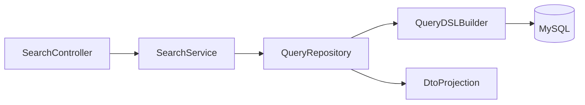

# Search API Architecture (QueryDSL)

## 1. Goal

Provide a unified, scalable search and listing contract for CRM modules with:

- GET list endpoints for simple filters via query parameters
- POST search endpoints using QueryDSL for complex dynamic filters
- configurable sorting
- pageable responses
- DTO projections only

## 1.1 GET List vs POST Search Decision Rule

| Use Case | Endpoint | Method |
|---|---|---|
| Simple listing with status/owner filter, pagination, column sort | `GET /crm/{resource}` | Query params: status, ownerUserId, page, size, sort |
| Multi-field filter with operators (BETWEEN, IN, LIKE, range) | `POST /crm/{resource}/search` | JSON body with filter DSL |
| Frontend table with basic column sort + pagination | GET list | Standard table view |
| Dashboard/reporting filter panels with complex criteria | POST search | Multi-criteria query |

GET list endpoints use Spring `Pageable` with `page`, `size`, and `sort` query parameters.
POST search endpoints use the full filter DSL defined below.

## 2. Standard Search Request Contract

```json
{
  "filters": [
    {
      "field": "status",
      "operator": "EQ",
      "value": "OPEN"
    }
  ],
  "sort": [
    {
      "field": "createdAt",
      "direction": "DESC"
    }
  ],
  "page": 0,
  "size": 20
}
```

## 3. Filter DSL Specification

### Supported Operators

- `EQ`, `NE`
- `IN`, `NOT_IN`
- `LIKE`, `STARTS_WITH`, `ENDS_WITH`
- `GT`, `GTE`, `LT`, `LTE`
- `BETWEEN`
- `IS_NULL`, `IS_NOT_NULL`

### Guardrails

- Only whitelisted fields are searchable per module.
- Unsupported operator-field combinations return `400`.
- `size` max = `100`.
- Default `page = 0`, `size = 20`.

## 4. Search Flow Architecture



## 5. Backend Implementation Pattern

- `controller`
  - Validate request envelope and pagination constraints.
- `service`
  - Authorize query scope and normalize defaults.
- `query repository`
  - Build `BooleanBuilder` predicates from filters.
  - Apply order specifiers.
  - Execute pageable QueryDSL query.
  - Map result to response DTO projection.

## 6. Response Contract

```json
{
  "content": [],
  "page": 0,
  "size": 20,
  "totalElements": 0,
  "totalPages": 0,
  "sort": [
    {
      "field": "createdAt",
      "direction": "DESC"
    }
  ]
}
```

## 7. Module-Specific Field Whitelists

### GET List Filter Parameters (query params)

| Module | Available Filters |
|---|---|
| Customer | status, ownerUserId, source |
| Lead | status, priority, ownerUserId |
| Opportunity | stage, ownerUserId, customerId |
| Activity | type, customerId, leadId, opportunityId |
| Task | status, assigneeUserId, priority, customerId |
| Note | customerId, leadId, opportunityId |

### POST Search Filterable Fields (QueryDSL)

- Customer: `fullName`, `email`, `phone`, `status`, `ownerUserId`, `source`, `companyName`, `createdAt`.
- Lead: `title`, `status`, `priority`, `expectedCloseDate`, `ownerUserId`, `contactName`, `contactEmail`, `expectedValue`, `createdAt`.
- Opportunity: `stage`, `amount`, `currency`, `closeDate`, `ownerUserId`, `customerId`, `title`, `createdAt`.
- Activity: `type`, `customerId`, `leadId`, `opportunityId`, `subject`, `activityDate`, `createdAt`.
- Task: `title`, `status`, `assigneeUserId`, `ownerUserId`, `priority`, `dueDate`, `customerId`, `leadId`, `opportunityId`, `createdAt`.
- Note: `content`, `customerId`, `leadId`, `opportunityId`, `createdAt`, `createdBy`.
- User: `username`, `email`, `fullName`, `status`, `createdAt`.

## 8. Security and Data Scope

- Search results are scoped by RBAC context:
  - admins: broader visibility
  - standard users: owner/team-scoped views.
- Always enforce `deleted = false` filter.
- Avoid exposing sensitive fields in projection DTO.

## 9. Performance Engineering Rules

- Add index before enabling new high-traffic filter fields.
- Prefer explicit projection instead of full entity fetch.
- Limit multi-column sort to avoid expensive query plans.
- Validate execution plans in pre-release for large datasets.

## 10. Error Handling

Standard search errors:

- `SEARCH_INVALID_FILTER_FIELD`
- `SEARCH_INVALID_OPERATOR`
- `SEARCH_INVALID_SORT_FIELD`
- `SEARCH_PAGE_SIZE_EXCEEDED`

Error payload follows the unified error envelope defined in [api/gateway-error-contract-v1.md](../api/gateway-error-contract-v1.md):
`code`, `message`, `details`, `traceId`, `timestamp`.
