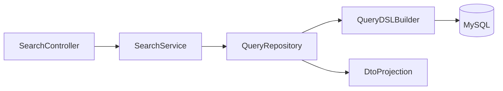

# Search API Architecture (QueryDSL)

## 1. Goal

Provide a unified, scalable search contract for CRM modules using QueryDSL with:

- dynamic filters
- configurable sorting
- pageable responses
- DTO projections only

## 2. Standard Search Request Contract

```json
{
  "filters": [
    {
      "field": "status",
      "operator": "EQ",
      "value": "OPEN"
    }
  ],
  "sort": [
    {
      "field": "createdAt",
      "direction": "DESC"
    }
  ],
  "page": 0,
  "size": 20
}
```

## 3. Filter DSL Specification

### Supported Operators

- `EQ`, `NE`
- `IN`, `NOT_IN`
- `LIKE`, `STARTS_WITH`, `ENDS_WITH`
- `GT`, `GTE`, `LT`, `LTE`
- `BETWEEN`
- `IS_NULL`, `IS_NOT_NULL`

### Guardrails

- Only whitelisted fields are searchable per module.
- Unsupported operator-field combinations return `400`.
- `size` max = `100`.
- Default `page = 0`, `size = 20`.

## 4. Search Flow Architecture



## 5. Backend Implementation Pattern

- `controller`
  - Validate request envelope and pagination constraints.
- `service`
  - Authorize query scope and normalize defaults.
- `query repository`
  - Build `BooleanBuilder` predicates from filters.
  - Apply order specifiers.
  - Execute pageable QueryDSL query.
  - Map result to response DTO projection.

## 6. Response Contract

```json
{
  "content": [],
  "page": 0,
  "size": 20,
  "totalElements": 0,
  "totalPages": 0,
  "sort": [
    {
      "field": "createdAt",
      "direction": "DESC"
    }
  ]
}
```

## 7. Module-Specific Search Examples

- Customer search fields:
  - `fullName`, `email`, `phone`, `status`, `ownerUserId`, `createdAt`.
- Lead search fields:
  - `title`, `status`, `priority`, `expectedCloseDate`, `ownerUserId`.
- Opportunity search fields:
  - `stage`, `amount`, `closeDate`, `ownerUserId`.

## 8. Security and Data Scope

- Search results are scoped by RBAC context:
  - admins: broader visibility
  - standard users: owner/team-scoped views.
- Always enforce `deleted = false` filter.
- Avoid exposing sensitive fields in projection DTO.

## 9. Performance Engineering Rules

- Add index before enabling new high-traffic filter fields.
- Prefer explicit projection instead of full entity fetch.
- Limit multi-column sort to avoid expensive query plans.
- Validate execution plans in pre-release for large datasets.

## 10. Error Handling

Standard search errors:

- `SEARCH_INVALID_FILTER_FIELD`
- `SEARCH_INVALID_OPERATOR`
- `SEARCH_INVALID_SORT_FIELD`
- `SEARCH_PAGE_SIZE_EXCEEDED`

Error payload returns `code`, `message`, and `traceId`.
