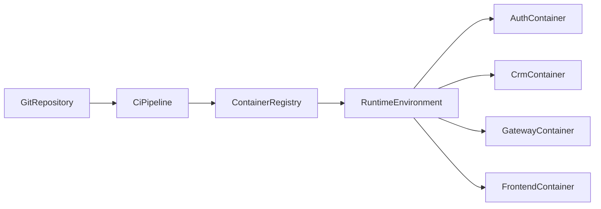

# Docker Deployment Architecture

## 1. Goals

- Ensure deterministic build/runtime behavior across environments.
- Minimize image size using multi-stage builds.
- Standardize image tagging and release promotion.

## 2. Container Inventory

- `auth-service` (Spring Boot)
- `crm-service` (Spring Boot)
- `api-gateway` (Spring Cloud Gateway)
- `frontend` (Next.js)

## 3. Build Strategy

### Backend Services (Java 21)

- Build stage:
  - Base image: `maven:3.9-eclipse-temurin-21`
  - Execute `mvn -B clean package -DskipTests` in CI packaging stage.
- Runtime stage:
  - Base image: `eclipse-temurin:21-jre-alpine`
  - Copy fat jar only.
  - Run as non-root user.

### Frontend (Next.js)

- Build stage:
  - Base image: `node:20-alpine`
  - Install dependencies and build standalone output.
- Runtime stage:
  - Base image: `node:20-alpine`
  - Copy `.next/standalone` and static assets.
  - Run as non-root user.

## 4. Dockerfile Blueprint (Backend Example)

```dockerfile
FROM maven:3.9-eclipse-temurin-21 AS build
WORKDIR /app
COPY pom.xml .
COPY src ./src
RUN mvn -B clean package -DskipTests

FROM eclipse-temurin:21-jre-alpine
WORKDIR /app
RUN addgroup -S app && adduser -S app -G app
COPY --from=build /app/target/*.jar app.jar
USER app
EXPOSE 8080
ENTRYPOINT ["java","-jar","/app/app.jar"]
```

## 5. Port and Runtime Mapping

- `auth-service`: container `8081`
- `crm-service`: container `8082`
- `api-gateway`: container `8080`
- `frontend`: container `3000`

## 6. Configuration and Secrets

- Use environment variables for:
  - DB URL/credentials
  - Redis URL
  - JWT secrets/keys
  - Sentry DSN
- Secrets must be injected by CI/CD runtime or orchestration platform.
- No secrets in Dockerfile or versioned `.env` files.

## 7. Image Tagging Strategy

- Commit tag: `:<git-sha>`
- Branch tag: `:<branch>-latest` (non-prod use)
- Release tag: `:vX.Y.Z`
- Production deploy uses immutable version tags only.

## 8. Deployment Topology



## 9. Release and Rollback

- Deploy strategy: rolling restart or blue/green based on environment maturity.
- Rollback strategy:
  - redeploy previous immutable image tags.
  - rollback order: gateway -> frontend -> services as needed by incident type.
- Keep last known-good release metadata in deployment records.

## 10. Runtime Hardening Checklist

- Non-root containers.
- Read-only filesystem where possible.
- Health checks configured for all services.
- Resource limits defined (CPU/memory requests and limits).
- Vulnerability scan gate before image push to production registry.
