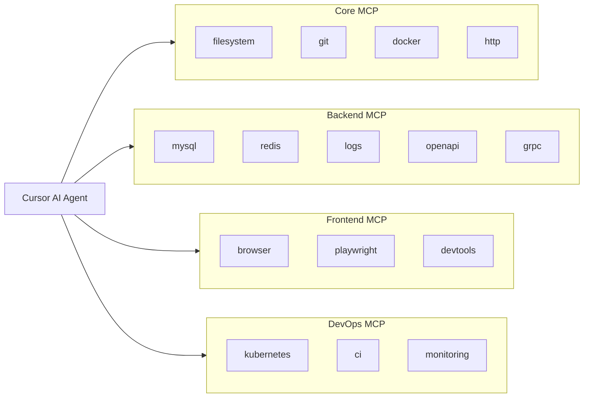
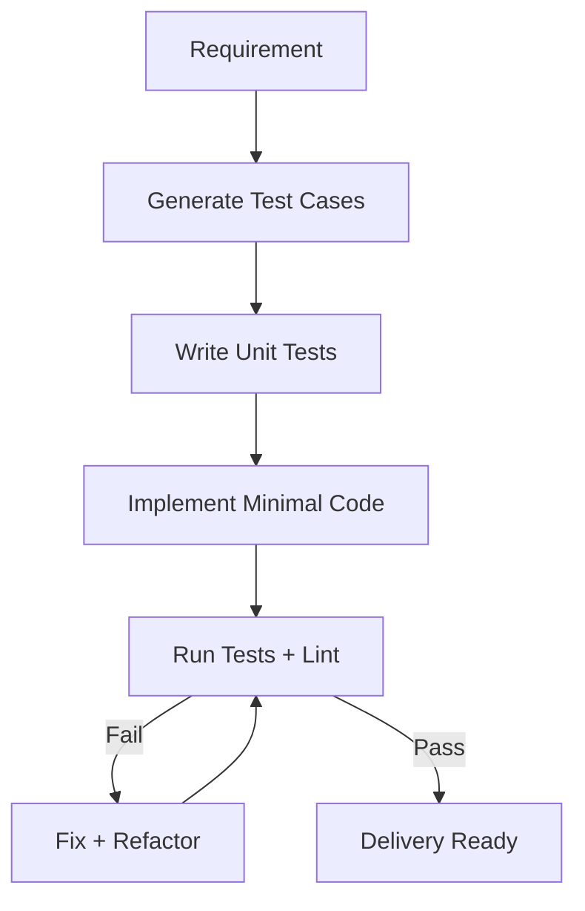
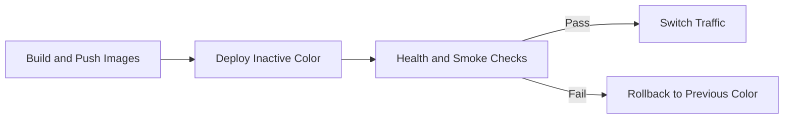

# Ultimate Cursor AI Coding Environment

Production-grade blueprint for fullstack enterprise delivery (Spring Boot + Next.js) at 200k+ LOC scale.

## 1) MCP Server Architecture (15 Servers)

### Logical Architecture



### MCP Matrix

| Server | Purpose | AI Read Context | Example Usage | Example Prompt |
|---|---|---|---|---|
| filesystem | Source code and docs context | files, docs, configs | inspect module boundaries | "Review `backend/auth-service` and detect layering violations." |
| git | Change awareness and safety | diffs, history, blame | identify risky refactor | "List changed business logic without test updates." |
| docker | Runtime parity and image diagnostics | Dockerfiles, logs, runtime env | check local/prod drift | "Compare container env with compose definitions." |
| http | API probing and health checks | endpoint responses, headers | verify auth and health | "Call login API and summarize error contract." |
| mysql | Data and query visibility | schema, indexes, query plans | tune read/write path | "Find missing indexes for user search path." |
| redis | Cache/session/rate-limit diagnostics | key stats, TTL, memory | debug stale cache | "Inspect `auth:*` TTL policy anomalies." |
| logs | Operational troubleshooting | structured logs, trace ids | root cause analysis | "Trace all failures for correlation id X." |
| openapi | Contract-first API checks | OpenAPI files and schema diff | contract drift detection | "Validate controller response with OpenAPI spec." |
| grpc | RPC contract governance | proto and service contracts | breaking-change checks | "List proto breaking changes from v1 to v2." |
| browser | Human-like UI context | rendered DOM and screenshot | UX validation | "Verify login error message and recovery flow." |
| playwright | Deterministic E2E automation | traces, network, screenshots | regression automation | "Run auth smoke flow and export report." |
| devtools | Frontend perf diagnostics | bundle, render, network profile | eliminate bottlenecks | "Find largest JS chunks on dashboard route." |
| kubernetes | Runtime and rollout state | pods, deployment, events, HPA | deployment safety | "Check rollout readiness and unhealthy pods." |
| ci | Pipeline intelligence | job logs, artifacts, statuses | fix failing CI | "Analyze failed test job and propose fix." |
| monitoring | SLO/SLA protection | metrics, traces, alerts | release risk checks | "Compare pre/post deploy p95 and error-rate." |

### Implemented Cursor Config

- File: `/.cursor/mcp.json`
- Includes all 15 MCP servers (Core, Backend, Frontend, DevOps)
- Uses environment variables for credentials and endpoint URLs
- Uses read-only mode for MySQL/Redis by default

## 2) Backend Enterprise Rules (Spring Boot)

### Applied Rule Files

- `/.cursor/rules/31-backend-enterprise-ultimate.mdc`
- `/.cursor/rules/32-backend-spring-anti-bug-top40.mdc`

### Enterprise Baseline

- Clean Architecture and strict layering: Controller -> Service -> Repository
- DTO boundary separation from JPA entities
- Global exception handling with standardized `error_code`
- Null safety and boundary validation with `@Valid`
- Mandatory pagination and deterministic sorting
- N+1 prevention and index strategy for MySQL
- Structured logging with trace/correlation id
- JWT validation, input validation, and rate limit policy
- Unit and integration testing as required quality gate

### Standard Error Contract Example

```json
{
  "error_code": "AUTH_INVALID_TOKEN",
  "message": "Token is invalid or expired",
  "trace_id": "3f2c7c55eb224178",
  "timestamp": "2026-03-11T08:45:12Z",
  "details": {}
}
```

## 3) Frontend Enterprise Rules (React / Next.js)

### Applied Rule Files

- `/.cursor/rules/33-frontend-enterprise-ultimate.mdc`
- `/.cursor/rules/34-frontend-react-antipatterns-top50.mdc`

### Recommended Feature Structure

```text
frontend/src/
  features/
    auth/
      components/
      hooks/
      api/
      types/
      store/
    users/
    orders/
```

### Enterprise Baseline

- Feature-first architecture
- Atomic design for shared reusable UI
- Component size and complexity caps
- Zustand for global UI/app state
- TanStack Query for server state and cache
- React Hook Form + Zod for form validation
- TanStack Table with virtualization for large datasets
- Performance controls: memoization, code splitting, lazy loading
- Top 50 anti-pattern denylist for scalability safety

## 4) Auto Test Workflow (AI-Driven)

### Applied Rule File

- `/.cursor/rules/35-ai-test-first-workflow.mdc`

### Enforced Flow



### Stack

- Backend: JUnit, Mockito, Testcontainers
- Frontend: Vitest, React Testing Library, Playwright
- CI policy: reject business logic changes without test deltas

## 5) CI/CD Integration (GitLab)

### Updated Pipeline

- Root: `/.gitlab-ci.yml` (includes `cicd/.gitlab-ci.yml`)
- Main pipeline updated: `/cicd/.gitlab-ci.yml`
- Stage order now:
  1. lint
  2. test
  3. build
  4. docker_build
  5. deploy
- Production deploy jobs are split by workload naming already used in this repository:
  - `auth-service`
  - `crm-service`
  - `api-gateway`
  - `frontend`

### Added Blue/Green Scripts

- `/devops/scripts/deploy-blue-green.sh`
- `/devops/scripts/rollback.sh`

### Deployment Model



### Zero-Downtime Controls

- deploy to inactive color first
- switch traffic to inactive color
- run smoke test immediately after traffic switch
- auto-revert selector to previous color when smoke test fails
- update active color label only after smoke test passes

### Required CI Variables (Production Blue/Green)

- `K8S_NAMESPACE`
- `AUTH_SMOKE_TEST_URL`
- `CRM_SMOKE_TEST_URL`
- `GATEWAY_SMOKE_TEST_URL`
- `FRONTEND_SMOKE_TEST_URL`
- `SMOKE_TEST_RETRIES` (optional)
- `SMOKE_TEST_DELAY_SECONDS` (optional)

## Enterprise Practices Embedded

- contract-first API governance
- deterministic CI gates
- strict architecture boundaries
- observability-aware release checks
- rollback-first deployment design
