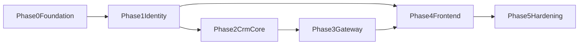

# Development Roadmap

## 1. Planning Assumptions

- Team model:
  - Backend: 2-3 engineers
  - Frontend: 1-2 engineers
  - QA: 1 engineer
  - DevOps: shared/platform support
- Iteration model: 2-week sprints.
- Initial horizon: 16-20 weeks for v1 production readiness.

## 2. Phase Plan

## Phase 0 - Foundation (Sprint 1)

### Objectives

- Establish repository and module skeleton.
- Finalize coding standards, API error model, and baseline tooling.
- Set up CI skeleton and local compose baseline.

### Deliverables

- `backend/*`, `frontend/*`, `devops/*` scaffolding.
- Baseline `.gitlab-ci.yml` + `cicd/.gitlab-ci.yml`.
- `docker-compose.yml` operational for local stack.

### Exit Criteria

- Project builds in CI.
- Local stack starts and health checks pass.

## Phase 1 - Identity and Access (Sprints 2-3)

### Objectives

- Build `auth-service` with JWT + refresh rotation.
- Implement RBAC entities and management APIs.

### Deliverables

- `/auth/login`, `/auth/refresh`, `/auth/logout`.
- User-role-claim-permission CRUD and assignment APIs.
- Auth integration tests and security baseline checks.

### Exit Criteria

- Token lifecycle validated.
- RBAC checks functional in protected test endpoints.

## Phase 2 - CRM Core Domain (Sprints 4-6)

### Objectives

- Implement core CRM modules:
  - customer, lead, opportunity, task, activity, note.

### Deliverables

- CRUD + status transition APIs.
- Soft-delete and audit compliance for all aggregates.
- QueryDSL search endpoints for core modules.

### Exit Criteria

- CRM service integration test suite passes.
- Search API supports dynamic filters and pageable response.

## Phase 3 - Gateway and Edge Controls (Sprint 7)

### Objectives

- Bring `api-gateway` online with route and policy controls.

### Deliverables

- Auth/CRM route configuration.
- Rate limiting with Redis.
- Request logging and trace propagation.

### Exit Criteria

- End-to-end route flow validated via integration tests.
- Gateway policy errors and 429 behavior verified.

## Phase 4 - Frontend MVP (Sprints 8-10)

### Objectives

- Deliver frontend auth flow and CRM operational views.

### Deliverables

- Login/session management with refresh handling.
- CRM list/detail workflows for customers, leads, opportunities.
- Task and activity UI modules with validated forms.

### Exit Criteria

- Role-based UI gating works for baseline roles.
- Frontend error monitoring integrated with Sentry.

## Phase 5 - Hardening and Release Readiness (Sprints 11-12)

### Objectives

- Improve performance, reliability, and release confidence.

### Deliverables

- Performance tuning on high-load search paths.
- Security review and dependency vulnerability cleanup.
- Production-grade CI/CD deployment flow and rollback drill.

### Exit Criteria

- SLA/SLO smoke checks pass.
- Release checklist signed by engineering + QA + product.

## 3. Dependency Map

## 4. Milestones

| Milestone | Target | Outcome |
|---|---|---|
| `M1` Foundation Complete | End Sprint 1 | Buildable baseline with local stack |
| `M2` Auth and RBAC Live | End Sprint 3 | Secure identity and token lifecycle |
| `M3` CRM Core API Stable | End Sprint 6 | Domain API and search baseline complete |
| `M4` E2E Platform Path | End Sprint 10 | UI -> Gateway -> Services flow in staging |
| `M5` Release Candidate | End Sprint 12 | Hardening complete, production readiness gate |

## 5. Definition of Done by Stream

### Backend

- Unit and integration tests pass.
- API docs updated.
- Error contract and audit fields compliant.

### Frontend

- Lint and tests pass.
- Form validation and error states covered.
- Query caching and loading states verified.

### DevOps

- Images build and scan pass.
- Deploy and rollback scripts validated in staging.

### QA

- Functional checklist passed.
- Critical regression suite green.

## 6. Risks and Controls by Phase

| Phase | Primary Risk | Control |
|---|---|---|
| 0 | Scaffold drift | Template lock + codeowner review |
| 1 | Token security defects | Security test suite and rotation tests |
| 2 | Query performance bottlenecks | Index-first review and dataset simulation |
| 3 | Gateway policy misconfiguration | Contract tests + canary rollout |
| 4 | UI-backend contract mismatch | Shared API schema validation |
| 5 | Release instability | rollback drill and release freeze checklist |

## 7. Release Gate Checklist

- Functional acceptance passed by product and QA.
- Performance baseline met for key workflows.
- Security scan has no critical unresolved findings.
- Observability dashboards and alerts operational.
- Rollback plan tested on current candidate build.
