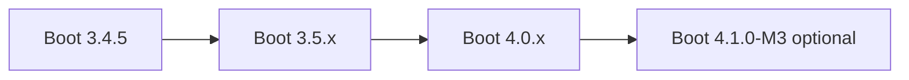

# Kế hoạch nâng cấp lên Spring Boot 4.1.0 và các package tương đồng

## Trạng thái thực hiện (đã hoàn thành Boot 4.0.4)

- **Spring Boot**: 4.0.4
- **Spring Cloud**: 2025.1.1
- **Gateway**: `spring-cloud-starter-gateway-server-webflux`, config `spring.cloud.gateway.server.webflux.*`
- **MetricsConfig**: `MeterRegistryCustomizer` → `org.springframework.boot.micrometer.metrics.autoconfigure`
- **Annotations**: `org.springframework.lang.NonNull/Nullable` → `jakarta.annotation.Nonnull/Nullable`
- **HttpStatus.UNPROCESSABLE_ENTITY** (deprecated) → `HttpStatus.valueOf(422)`

---

## Lưu ý quan trọng về phiên bản

| Phiên bản | Trạng thái | Ghi chú |
|-----------|------------|---------|
| **Spring Boot 4.0.x** | GA (ổn định) | Khuyến nghị cho production |
| **Spring Boot 4.1.0** | Chưa GA | Hiện mới có milestone: 4.1.0-M1, M2, M3 (Mar 2026) |

**Kết luận**: Nếu cần ổn định production → dùng **4.0.x**. Nếu chấp nhận rủi ro early adopter → dùng **4.1.0-M3**.

---

## Bảng nâng cấp package (target: Boot 4.0 hoặc 4.1.0-M3)

| Package | Hiện tại | Boot 4.0 | Boot 4.1.0-M3 | Ghi chú |
|---------|----------|----------|---------------|---------|
| **Spring Boot** | 3.4.5 | 4.0.x (ví dụ 4.0.3) | 4.1.0-M3 | Parent POM |
| **Spring Cloud** | 2024.0.3 | **2025.1.x** | 2025.1.x | Bắt buộc cho Boot 4; 2025.0.x KHÔNG tương thích |
| **Spring Framework** | 6.2 (qua Boot) | 7.0 | 7.0.x | Qua Boot BOM |
| **Spring Data** | 2024.x | 2025.1 | 2026.0.0-M2 | Qua Boot BOM |
| **Spring Security** | 6.x | 7.0 | 7.1.0-M3 | Qua Boot BOM |
| **Java** | 21 | 17+ (21 OK) | 17+ | Repo đang 21 — giữ |
| **Jackson** | 2.x | **3.0** | 3.x | Breaking API changes |
| **Jakarta EE** | 10 | **11** | 11 | Servlet 6.1 baseline |
| **Hibernate** | 6.x | **7.1** | 7.x | Qua Boot BOM |
| **Hibernate Validator** | 8.x | **9.0** | 9.x | Qua Boot BOM |
| **QueryDSL** | 5.1.0 (jakarta) | 5.1.0+ / 6.x | Kiểm tra tương thích JPA 3.2 | Có thể cần bump |
| **JJWT** | 0.12.6 | Kiểm tra Jackson 3 | Kiểm tra Jackson 3 | Có thể cần jjwt-api 0.13+ hoặc fork tương thích |
| **MapStruct** | 1.6.3 | 1.6.x / 1.7.x | 1.6.x+ | Thường tương thích |
| **Lombok** | 1.18.34 | Giữ hoặc bump | Giữ | Thường tương thích |
| **Flyway** | (flyway-core) | **spring-boot-starter-flyway** | spring-boot-starter-flyway | Boot 4 yêu cầu starter thay vì dependency trực tiếp |
| **Gatling** | 3.11.5 | 3.11+ / 4.x | Kiểm tra | Test dependency |
| **SpotBugs** | 4.8.3.0 | Giữ | Giữ | Plugin Maven |

---

## Migration path (theo khuyến nghị Spring)



1. **Bước 1**: Nâng lên **Spring Boot 3.5.x** (patch mới nhất) — giải quyết deprecated, chuẩn bị dependency.
2. **Bước 2**: Áp dụng [Spring Boot 4.0 Migration Guide](https://github.com/spring-projects/spring-boot/wiki/Spring-Boot-4.0-Migration-Guide).
3. **Bước 3** (nếu chọn 4.1): Chuyển sang 4.1.0-M3 và xử lý breaking changes từ M1–M3.

---

## Thay đổi cụ thể cho SpringCRM

### 1. Parent POM ([`backend/pom.xml`](backend/pom.xml))

```xml
<!-- Option A: 4.0 GA (ổn định) -->
<parent>
    <groupId>org.springframework.boot</groupId>
    <artifactId>spring-boot-starter-parent</artifactId>
    <version>4.0.3</version>  <!-- hoặc patch mới nhất 4.0.x -->
</parent>

<!-- Option B: 4.1.0-M3 (milestone) -->
<parent>
    <groupId>org.springframework.boot</groupId>
    <artifactId>spring-boot-starter-parent</artifactId>
    <version>4.1.0-M3</version>
</parent>

<properties>
    <spring-cloud.version>2025.1.1</spring-cloud.version>  <!-- hoặc 2025.1.x mới nhất -->
    <!-- querydsl, jjwt, mapstruct — verify compatibility sau khi bump Boot -->
</properties>
```

### 2. Flyway — Bắt buộc đổi sang starter

**auth-service** (và mọi module dùng Flyway):

```xml
<!-- Cũ -->
<dependency>
    <groupId>org.flywaydb</groupId>
    <artifactId>flyway-core</artifactId>
</dependency>
<dependency>
    <groupId>org.flywaydb</groupId>
    <artifactId>flyway-mysql</artifactId>
</dependency>

<!-- Mới (Boot 4) -->
<dependency>
    <groupId>org.springframework.boot</groupId>
    <artifactId>spring-boot-starter-flyway</artifactId>
</dependency>
<dependency>
    <groupId>org.flywaydb</groupId>
    <artifactId>flyway-mysql</artifactId>
</dependency>
```

### 3. Test dependencies — Starter test theo module

Boot 4 dùng starters modular. Ví dụ **auth-service**:

```xml
<!-- Cũ -->
<dependency>
    <groupId>org.springframework.boot</groupId>
    <artifactId>spring-boot-starter-test</artifactId>
</dependency>
<dependency>
    <groupId>org.springframework.security</groupId>
    <artifactId>spring-security-test</artifactId>
</dependency>

<!-- Mới (Boot 4) — dùng starter cho công nghệ đang test -->
<dependency>
    <groupId>org.springframework.boot</groupId>
    <artifactId>spring-boot-starter-security-test</artifactId>
</dependency>
<!-- spring-boot-starter-test được kéo transitively -->
```

Tương tự cho **crm-service**, **api-gateway** (gateway dùng reactor → `spring-boot-starter-reactor-netty` đã có; test có thể cần `spring-boot-starter-webflux-test` nếu dùng WebFlux).

### 4. JJWT và Jackson 3

Boot 4 dùng Jackson 3. JJWT 0.12.x dùng Jackson 2. Cần:

- Kiểm tra [jjwt releases](https://github.com/jwtk/jjwt/releases) có bản hỗ trợ Jackson 3 chưa, hoặc
- Exclude Jackson 2 từ JJWT và dùng Jackson 3 (có thể gây lỗi serialization).

Nếu JJWT chưa tương thích → cân nhắc tạm giữ Jackson 2 (deprecated trong Boot 4) hoặc tìm thư viện JWT khác (vd. `nimbus-jose-jwt`).

### 5. QueryDSL

- JPA 3.2 / Hibernate 7.1 có thể thay đổi API. QueryDSL 5.1 (jakarta) cần kiểm tra.
- [QueryDSL releases](https://github.com/querydsl/querydsl/releases) — xem có 6.x cho Jakarta EE 11/JPA 3.2 chưa.

### 6. Breaking changes ảnh hưởng SpringCRM

| Thay đổi | Ảnh hưởng |
|----------|-----------|
| Undertow bị loại bỏ | Repo dùng Tomcat (mặc định) — không ảnh hưởng |
| Flyway/Liquibase cần starter | auth-service dùng Flyway — phải đổi |
| Test starters modular | Cần cập nhật spring-security-test → spring-boot-starter-security-test |
| `EnvironmentPostProcessor` package đổi | Nếu có custom post-processor — cập nhật import |
| Jackson 2 deprecated | JJWT có thể conflict — xử lý riêng |
| `management.tracing.enabled` → `management.tracing.export.enabled` | Kiểm tra config nếu dùng |

---

## Thứ tự thực hiện đề xuất

1. **Phase 1**: Nâng Boot 3.4.5 → 3.5.x; chạy `mvn clean verify`; sửa deprecated.
2. **Phase 2**: Đổi Flyway sang starter; đổi test dependencies sang Boot 4 starters.
3. **Phase 3**: Bump Boot 4.0.x (hoặc 4.1.0-M3) + Spring Cloud 2025.1.x.
4. **Phase 4**: Fix compile errors (import, API changes); xử lý JJWT/Jackson nếu có.
5. **Phase 5**: Fix integration tests; cập nhật config properties (tracing, v.v.).
6. **Phase 6**: Chạy SpotBugs, OWASP check; full `mvn verify`.

---

## Rủi ro và lưu ý

- **4.1.0-M3**: Milestone, có thể có breaking changes trước GA. Không khuyến nghị cho production.
- **Jackson 3**: Nhiều thư viện chưa migrate. JJWT, Logstash encoder, v.v. cần kiểm tra.
- **Spring Cloud 2025.1**: Release mới; cần verify Gateway, Config (nếu dùng) hoạt động đúng.
- **QueryDSL/JPA 3.2**: Có thể cần đợi bản QueryDSL tương thích hoặc workaround.

---

## Tài liệu tham khảo

- [Spring Boot 4.0 Release Notes](https://github.com/spring-projects/spring-boot/wiki/Spring-Boot-4.0-Release-Notes)
- [Spring Boot 4.0 Migration Guide](https://github.com/spring-projects/spring-boot/wiki/Spring-Boot-4.0-Migration-Guide)
- [Spring Boot 4.1.0-M3 Release Notes](https://github.com/spring-projects/spring-boot/wiki/Spring-Boot-4.1.0-M3-Release-Notes)
- [Spring Cloud Supported Versions](https://github.com/spring-cloud/spring-cloud-release/wiki/Supported-Versions)
- [Boot 4.0 Dependency Versions](https://docs.spring.io/spring-boot/4.0/reference/html/dependency-versions.html)
